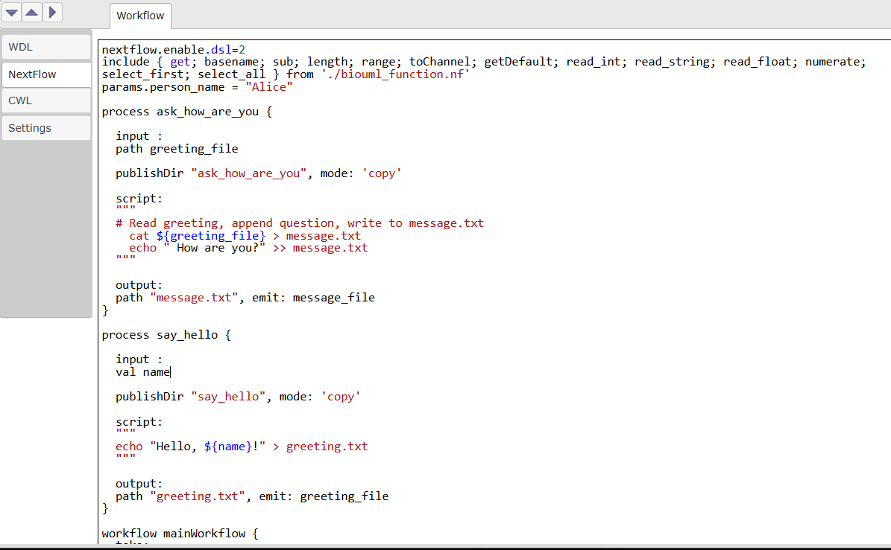
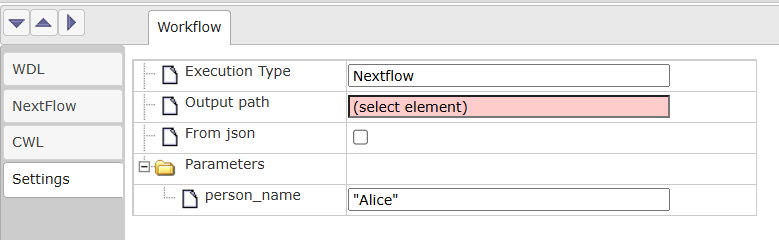
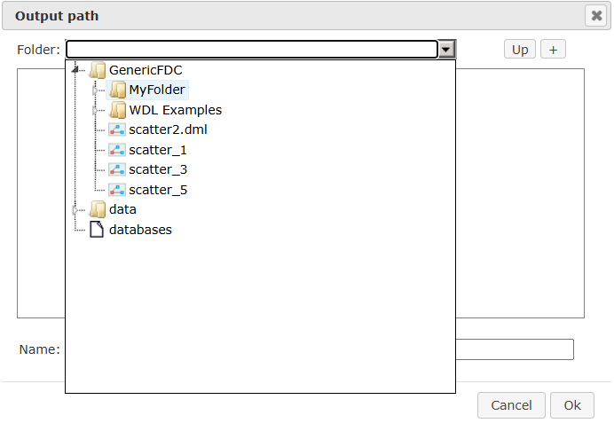
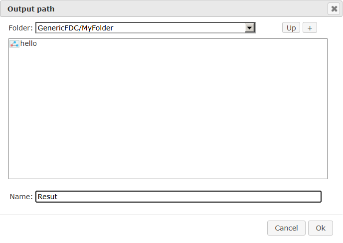
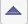

Web interface
=============

Local instance
--------------

To build your own instance of web application do following:

1. Instal Java 21 (JRE or JDK).
2. Download source code from https://github.com/genespace-ru/workflow-engine.
3. Build workflow-engine:

::

 mvn package -DskipTests

4. Launch workflow-engine web edition with next command: 

::

 mvn jetty:run -Djetty.http.port=9998 -Dmaven.javadoc.skip=true -DskipTests=true

5. Use your browser to open http://localhost:9998/

Existing web server
-------------------

Open Web application in browser (workflow.genespace.ru). You will see interface.

.. image:: webInterface_images/interface.png
   :alt: interface
   :width: 600px 

Right click on GenericFDC root folder and select New folder.

.. image:: webInterface_images/new_folder.png
   :alt: new_folder
   :width: 600px 

In appeared dialog write name for you folder and press Ok.

.. image:: webInterface_images/new_folder_dialog.png
   :alt: new_folder_dialog

To import WDL to created folder right click on it and select Import WDL.
In appeared window choose Computer and find appropriate file in your file system.

.. image:: webInterface_images/browse_file.png
   :alt: browse_file

WDL script will be added to your folder and automatically open as visual diagram.

.. image:: webInterface_images/diagram.png
   :alt: diagram

Go to the bottom panel, in WDL tab you will see WDl script. It may differ from your initial script as it is automatically generated from diagram (e.g. comments are not supported and will be removed. You can change WDL text and apply changes to diagram by clicking on |apply-icon| button.

.. image:: webInterface_images/wdl_tab.png
   :alt: wdl_tab

In Nextflow tab you will see autogenerated Nextflow.

In the Settings tab you can set output folder and parameter values. Parameters may be set either manually for each individual parameter or by selecting the json file in the repository tree. 

To set Output path by click on (select element), choose folder in repository tree and type results name (e.g. "Result") in appeared window.

To choose path for json file in repository check From json option and choose json file in repository tree.

.. image:: webInterface_images/json_select.png
   :alt: json_select

Finally run nextflow by pressing |run-icon| button, after execution is finished, result will appear in output folder.

