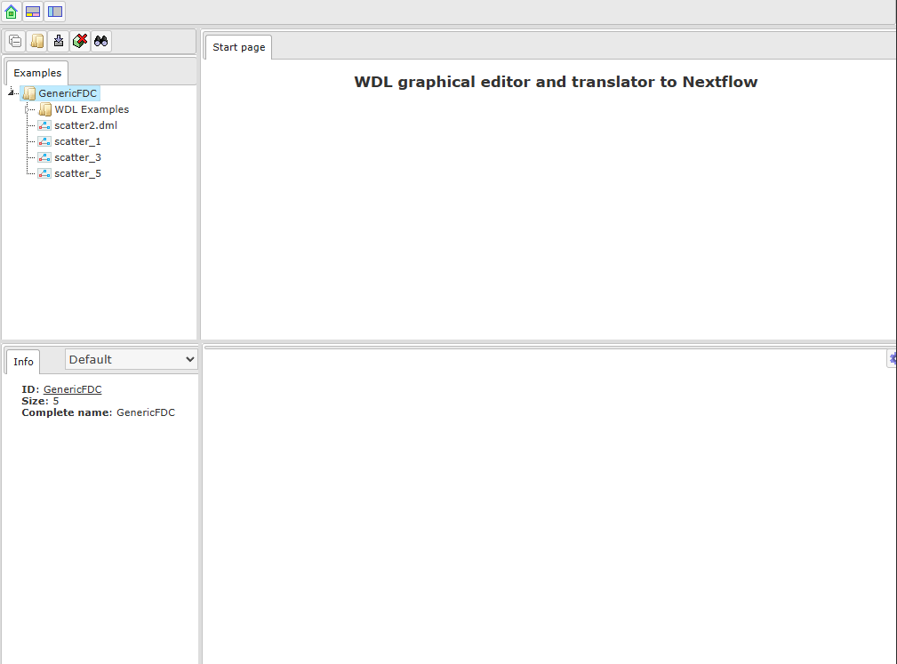
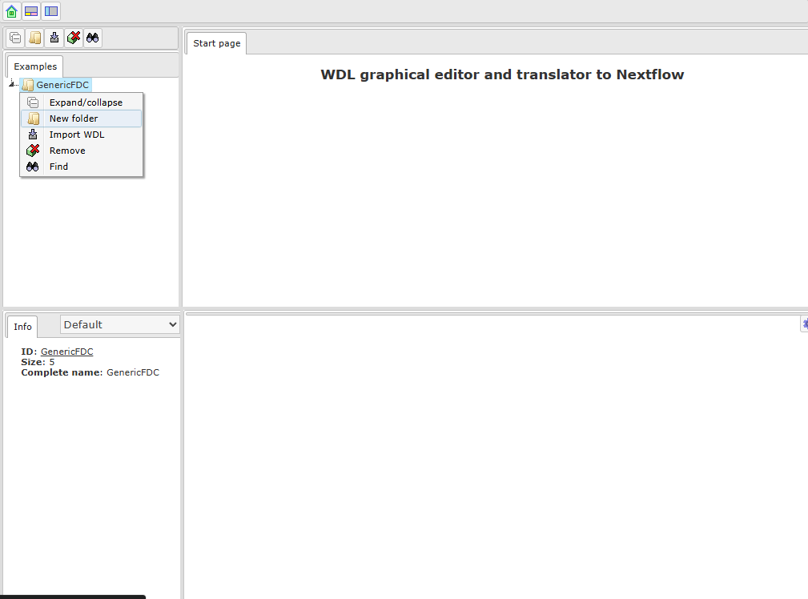
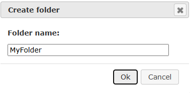
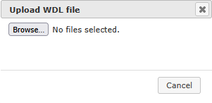
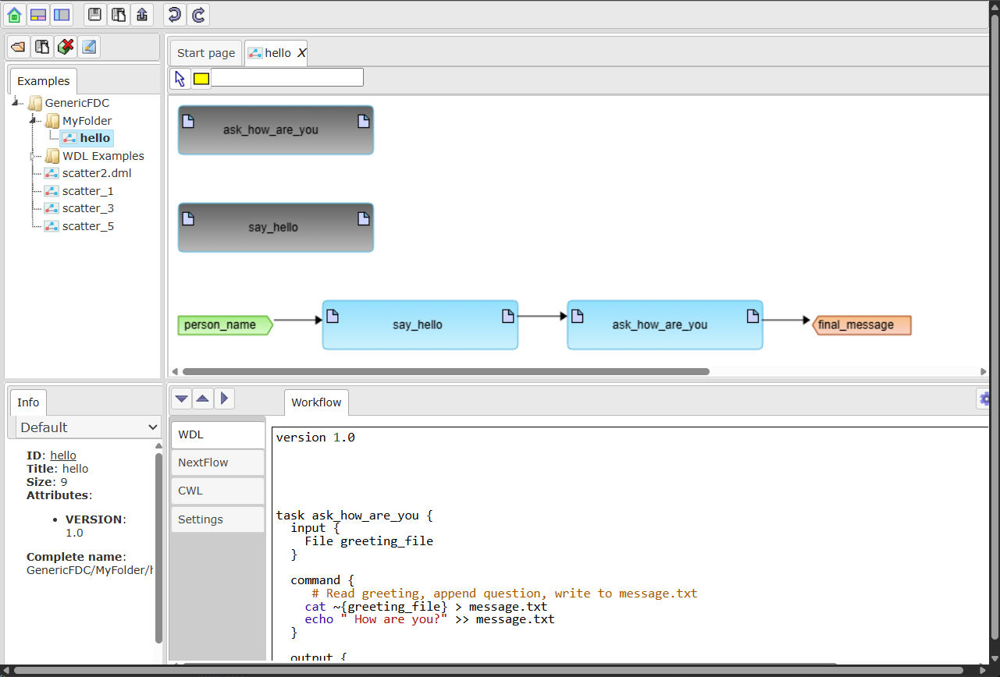
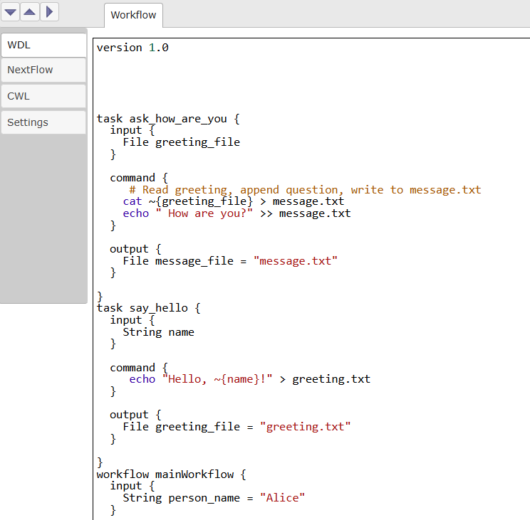
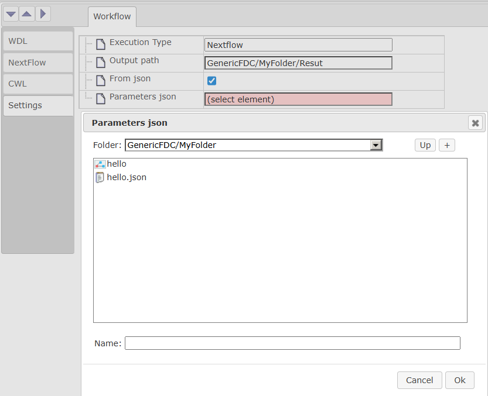

Web interface
=============

Open Web application in browser (workflow.genespace.ru). You will see interface.

Right click on GenericFDC root folder and select New folder.

In appeared dialog write name for you folder and press Ok.

To import WDL to created folder right click on it and select Import WDL.
In appeared window choose Computer and find appropriate file in your file system.

WDL script will be added to your folder and automatically open as visual diagram.

Go to the bottom panel, in WDL tab you will see WDl script. It may differ from your initial script as it is automatically generated from diagram (e.g. comments are not supported and will be removed. You can change WDL text and apply changes to diagram by clicking on Apply button ()

In Nextflow tab you will see autogenerated Nextflow.

.. image:: webInterface_images/nextflow_tab.png
   :alt: nextflow_tab

In the Settings tab you can set output folder and parameter values. Parameters may be set either manually for each individual parameter or by selecting the json file in the repository tree. 

.. image:: webInterface_images/settings_tab.png
   :alt: settings_tab

To set Output path by click on (select element), choose folder in repository tree and type results name (e.g. "result") in appeared window

.. image:: webInterface_images/output_select.png
   :alt: output_select

To choose path for json file in repository check From json option and choose json file in repository tree

Finally run nextflow by pressing ( )  button, after execution is finished, result will appear in output folder

.. image:: images/Result.png
   :alt: Web application interface
